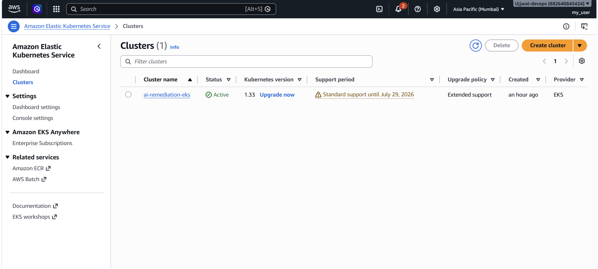
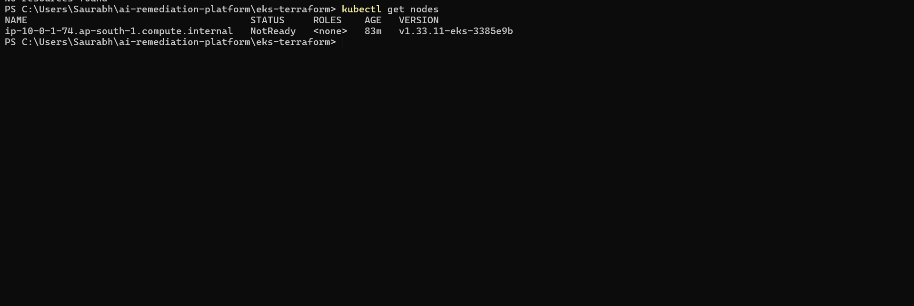

# AI Remediation Platform

AI-powered Kubernetes auto-remediation platform that detects pod failures, performs AI-driven root cause analysis, executes automated remediation actions, sends Slack notifications, stores audit logs, and exposes Prometheus metrics.

Built using Python, Kubernetes, Amazon EKS, Terraform, GitHub Actions, OpenAI, Prometheus, and Grafana. 

## Amazon EKS Cluster Provisioning

The AI Remediation Platform is deployed on Amazon Elastic Kubernetes Service (EKS).

The Kubernetes cluster and networking infrastructure are provisioned using Terraform, including:

- Amazon EKS Cluster
- Managed Node Group
- VPC
- Public and Private Subnets
- NAT Gateway
- Core Kubernetes Addons
  - CoreDNS
  - kube-proxy
  - VPC CNI

### EKS Cluster Status

*Amazon EKS cluster successfully provisioned and running in ap-south-1.*

### Cluster Validation

(docs/screenshots/01-eks-cluster/Screenshot(207).png)

*Kubernetes worker node successfully joined the EKS control plane.*