# AI Remediation Platform

AI-powered Kubernetes auto-remediation platform that detects pod failures, performs AI-driven root cause analysis, executes automated remediation actions, sends Slack notifications, stores audit logs, and exposes Prometheus metrics.

Built using Python, Kubernetes, Amazon EKS, Terraform, GitHub Actions, OpenAI, Prometheus, and Grafana. 

## Architecture Overview

The AI-Powered Kubernetes Auto-Remediation Platform continuously monitors Kubernetes workloads running on Amazon EKS and automatically responds to application failures.

The project was initially developed on a local Kind cluster and later migrated to Amazon EKS to demonstrate production-grade deployment patterns.

During early development, Ollama was used as the AI provider. The final implementation uses OpenAI for automated root cause analysis.

I have taken intentional decision to show pod failures using few incidents like `crashloopbackoff` and `oom killed` because my focus was to demonstrate End-to-End AIOps workflow. This same code can be used with other container failure types.

When a pod enters a failed state such as `CrashLoopBackOff`, `oom-killed`the monitor-agent collects pod status information, application logs, and Kubernetes events. The incident data is then sent to OpenAI for root cause analysis.

Based on the AI-generated assessment, the remediation engine automatically executes corrective actions through the Kubernetes API, such as restarting the affected deployment. The platform also sends detailed Slack notifications, stores audit records, and exposes operational metrics to Prometheus for monitoring and visualization through Grafana.

This architecture enables intelligent incident detection, AI-assisted troubleshooting, automated remediation, observability, and operational transparency within Kubernetes environments.

### Architecture Diagram

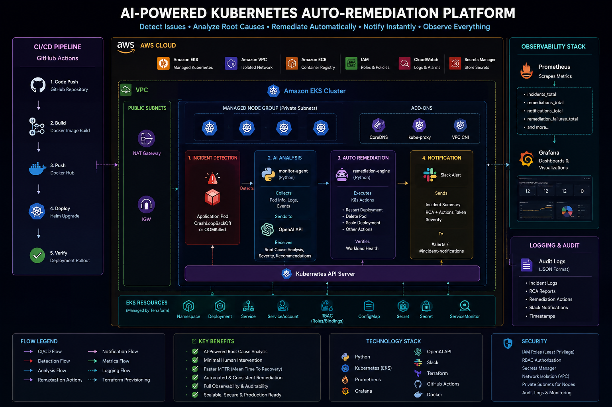

*End-to-end architecture of the AI-Powered Kubernetes Auto-Remediation Platform running on Amazon EKS with Terraform provisioning, GitHub Actions CI/CD, OpenAI-powered root cause analysis, automated remediation, Slack notifications, Prometheus monitoring, and Grafana dashboards.*

### Architecture Flow

1. Source code is pushed to GitHub.
2. GitHub Actions builds and deploys the monitor-agent container.
3. Terraform provisions AWS infrastructure and Kubernetes resources.
4. The monitor-agent continuously monitors Kubernetes workloads.
5. Failed pods are detected automatically.
6. Pod logs, events, and status information are collected.
7. OpenAI performs root cause analysis and generates recommendations.
8. The remediation engine executes recovery actions through the Kubernetes API.
9. Slack notifications are sent with incident details and remediation results.
10. Audit logs are stored for operational tracking.
11. Prometheus collects platform metrics.
12. Grafana visualizes incidents, remediations, notifications, and infrastructure health.

### Key Platform Capabilities

- AI-powered root cause analysis using OpenAI
- Automated Kubernetes remediation
- Slack-based incident notifications
- Audit logging and operational traceability
- Prometheus metrics collection
- Grafana observability dashboards
- Infrastructure as Code using Terraform
- CI/CD automation using GitHub Actions

## Technology Stack

| Category | Tools |
|-----------|---------|
| Cloud | AWS |
| Container Platform | Kubernetes (EKS) |
| IaC | Terraform |
| CI/CD | GitHub Actions |
| Programming | Python |
| AI | OpenAI API , Ollama ( Development ) |
| Monitoring | Prometheus |
| Visualization | Grafana |
| Notifications | Slack |

## Amazon EKS Cluster Provisioning

The AI Remediation Platform is deployed on Amazon Elastic Kubernetes Service (EKS).

The Kubernetes cluster and networking infrastructure are provisioned using Terraform, including:

- Amazon EKS Cluster
- Managed Node Group
- VPC
- Public and Private Subnets
- NAT Gateway
- Core Kubernetes Addons
  - CoreDNS
  - kube-proxy
  - VPC CNI

### EKS Cluster Status

*Amazon EKS cluster successfully provisioned and running in ap-south-1.*

### Cluster Validation

*Kubernetes worker node successfully joined the EKS control plane.*

### Core Kubernetes Components

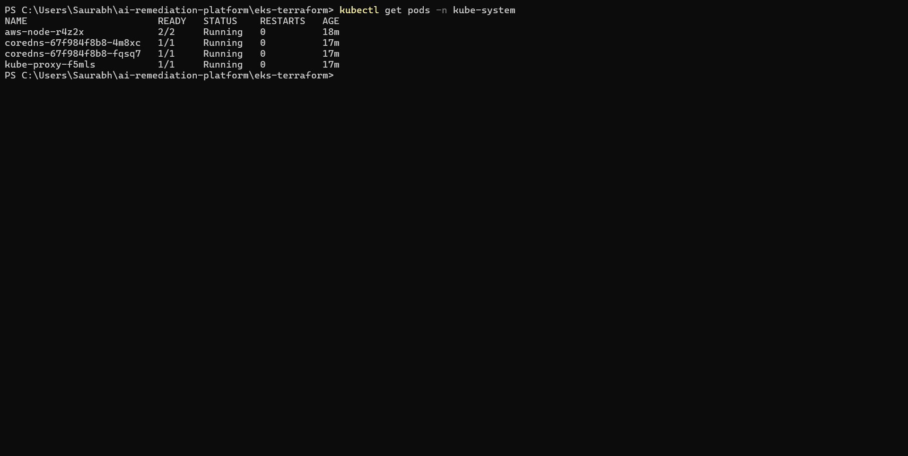

*Core EKS system components including CoreDNS, kube-proxy, and VPC CNI running successfully.*

### Cluster Health Verification

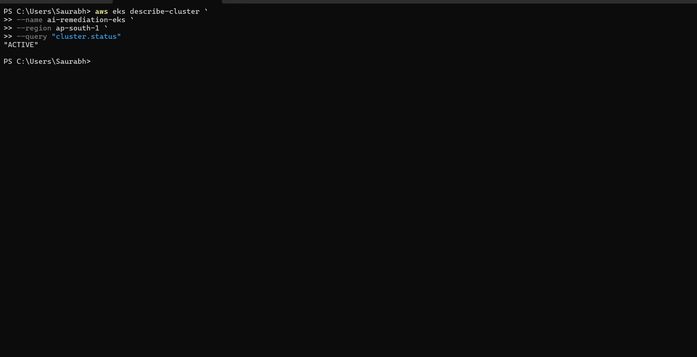

*AWS CLI validation confirming the EKS cluster is in ACTIVE state.*

## Infrastructure as Code with Terraform

The complete AWS infrastructure and Kubernetes deployment are managed using Terraform.

Infrastructure provisioning includes:

- Amazon EKS Cluster
- Managed Node Groups
- VPC and Networking
- Public and Private Subnets
- NAT Gateway
- Kubernetes Namespace
- RBAC Configuration
- ServiceMonitor Resources

### Terraform Initialization

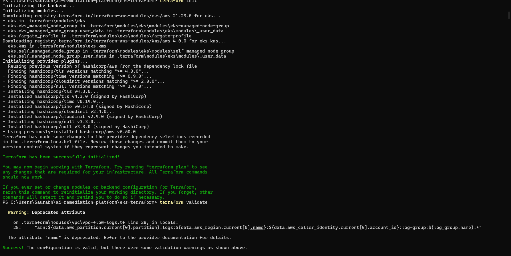

*Terraform initialization downloading required providers and EKS modules.*

## CI/CD Pipeline

The platform uses GitHub Actions to automate application delivery to Amazon EKS.

Pipeline capabilities include:

- Source code checkout
- AWS authentication
- EKS cluster access configuration
- Docker image build
- Docker image push to Docker Hub
- Kubernetes deployment updates
- Automated rollout verification

### Workflow History

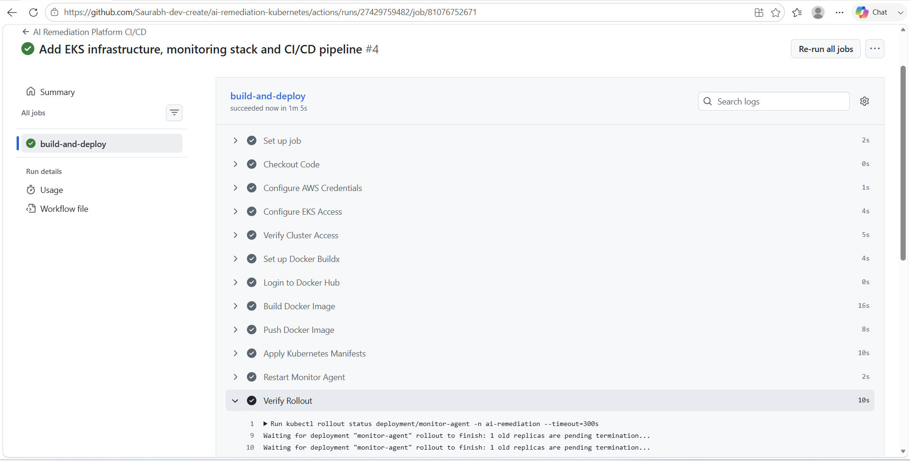

*GitHub Actions workflow history showing iterative development, deployment validation, and successful production deployments.*

### Successful Deployment Pipeline

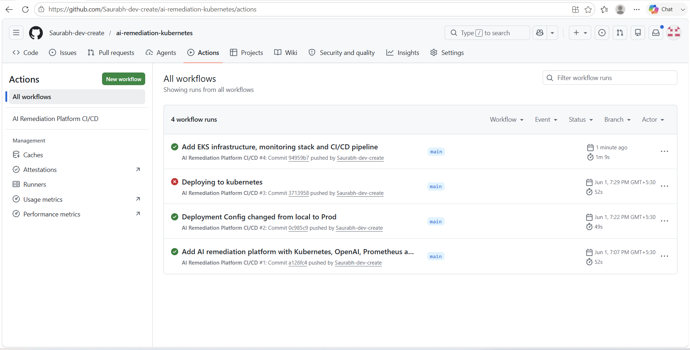

*End-to-end CI/CD pipeline successfully building, publishing, and deploying the AI Remediation Platform to Amazon EKS.*

## Incident Detection

The monitor-agent continuously watches Kubernetes workloads running inside the cluster.

When an application pod enters a failed state such as `CrashLoopBackOff`, the monitor-agent detects the incident and starts the AI remediation workflow.

### Failed Application Detected

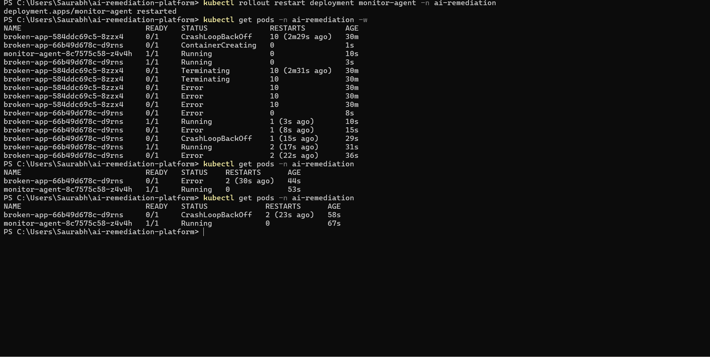

*The monitor-agent detects a failed application pod in `CrashLoopBackOff` state while continuing to run normally inside the cluster.*

The platform was validated against multiple Kubernetes failure scenarios including:

- CrashLoopBackOff
- OOMKilled

### OOMKilled Detection

[screenshot](docs/screenshots/05-incident-detection/oom-killed-detected.png)

*The monitor-agent successfully detected an OOMKilled workload and initiated the AI analysis workflow.*

## AI Root Cause Analysis

After detecting a failed Kubernetes workload, the monitor-agent gathers pod status information and application logs from the cluster.

The incident details are then sent to OpenAI for automated analysis.

The AI engine generates:

- Root cause analysis
- Incident severity assessment
- Recommended remediation actions
- Operational guidance for engineers
- Confidence score

This reduces manual troubleshooting effort and helps operators quickly understand why the workload failed.

### AI Incident Analysis

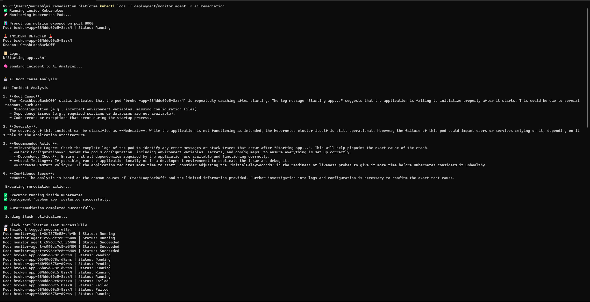

*OpenAI-generated incident analysis identifying the probable cause of the CrashLoopBackOff failure, providing severity classification, recommended troubleshooting actions, and remediation guidance.*

### AI Analysis Workflow

The analysis process follows these steps:

1. Monitor-agent detects a failed Kubernetes pod.
2. Pod logs and status information are collected.
3. Incident data is sent to OpenAI.
4. OpenAI performs root cause analysis.
5. A structured remediation report is generated.
6. Results are forwarded to the remediation engine and notification system.

This allows the platform to move beyond simple monitoring by providing AI-assisted operational insights before remediation actions are executed.

## Automated Remediation

After the AI analysis is completed, the platform automatically executes a remediation workflow.

For CrashLoopBackOff incidents, the remediation engine performs a Kubernetes deployment restart to recover the affected workload.

The remediation process is executed from inside the cluster and is fully automated without manual intervention.

### Remediation Execution

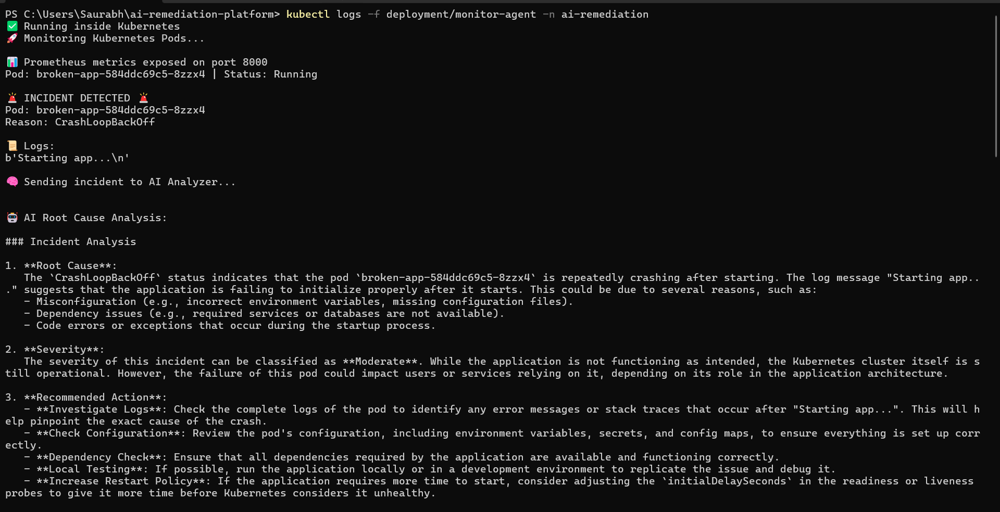

*The remediation engine automatically executes a Kubernetes deployment restart after AI analysis, successfully recovering the failed application workload.*

## Slack Notifications

The platform automatically sends incident notifications to Slack after completing AI analysis and remediation activities.

Each notification contains:

* Affected Kubernetes pod
* Incident type
* AI-generated root cause analysis
* Severity assessment
* Recommended remediation actions
* Operational guidance for engineers

This ensures that engineering teams remain informed about production incidents while maintaining a complete audit trail of remediation activities.

### Incident Alert Delivered to Slack

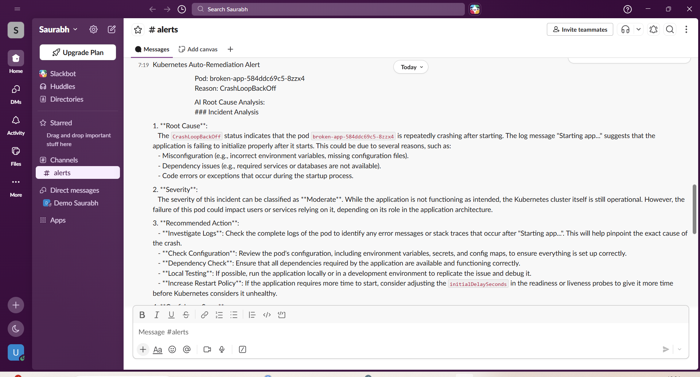

*Automated Slack notification containing AI-generated root cause analysis, severity assessment, and recommended remediation actions for a Kubernetes CrashLoopBackOff incident.*

### Notification Workflow

The notification process follows these steps:

1. Monitor-agent detects a failed Kubernetes workload.
2. Pod logs and status information are collected.
3. OpenAI generates a root cause analysis report.
4. Remediation actions are executed automatically.
5. A detailed incident report is delivered to Slack.
6. Engineers receive immediate visibility into the incident and remediation outcome.

This integration enables faster operational awareness and improves incident response workflows across engineering teams.

## Monitoring and Observability

The AI Remediation Platform exposes operational metrics through Prometheus and provides real-time visualization using Grafana.

All critical platform activities are tracked, including:

* Incident detection events
* AI analysis executions
* Automated remediation actions
* Slack notification deliveries
* Remediation failures
* Kubernetes cluster health metrics

This enables engineers to monitor platform behavior, validate remediation outcomes, and gain visibility into cluster operations.

### Prometheus Metrics Export

The monitor-agent exposes custom metrics that are collected by Prometheus.

Tracked metrics include:

* incidents_total
* remediations_total
* notifications_total
* remediation_failures_total

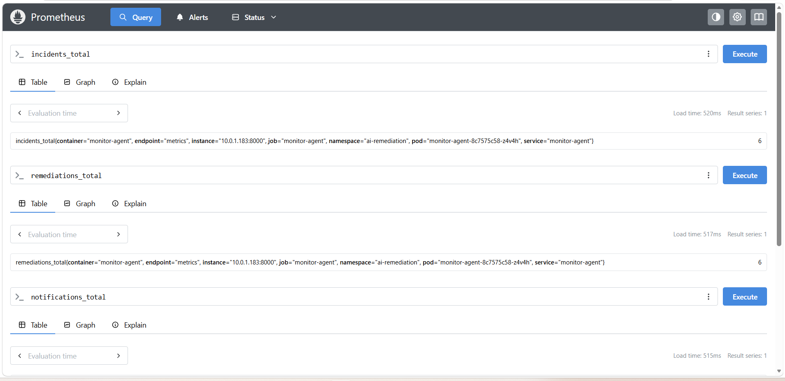

*Custom application metrics exposed by the monitor-agent and collected by Prometheus for incident tracking, remediation monitoring, and operational visibility.*

### Prometheus Target Discovery

Prometheus automatically discovers and scrapes the monitor-agent using Kubernetes ServiceMonitor resources.

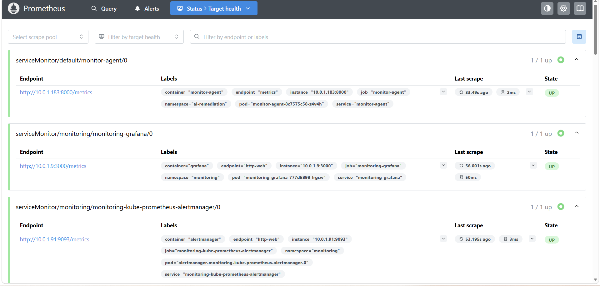

*Prometheus successfully scraping monitor-agent metrics through Kubernetes-native service discovery and ServiceMonitor configuration.*

### Incident Analytics Dashboard

Grafana dashboards provide visibility into platform activity and remediation effectiveness.

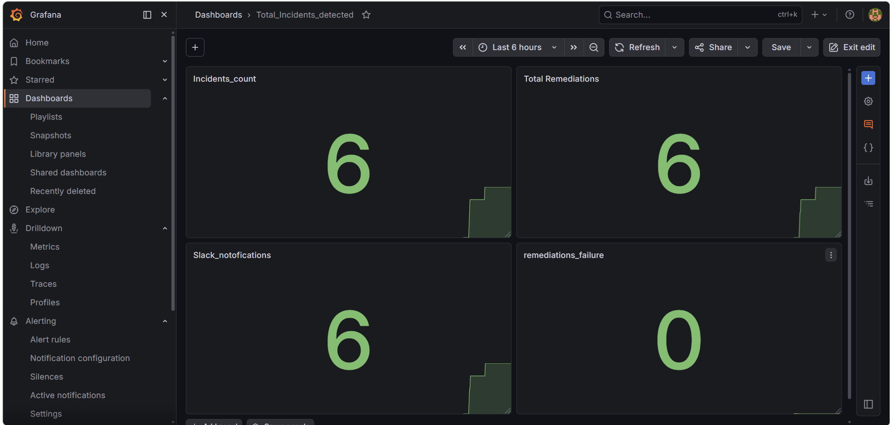

*Grafana dashboard visualizing detected incidents, remediation executions, Slack notifications, and remediation success metrics.*

### Kubernetes Cluster Monitoring

The platform integrates with Kubernetes monitoring dashboards to provide infrastructure-level visibility.

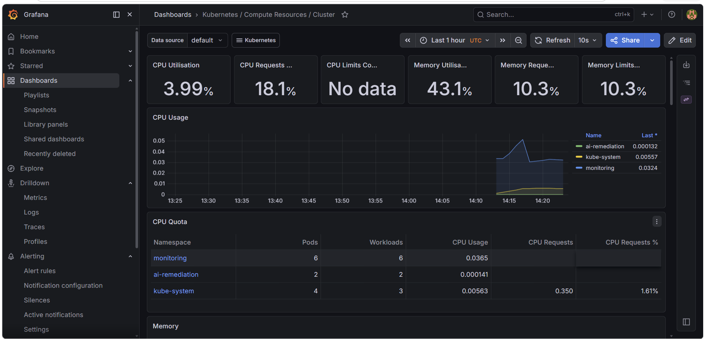

*Real-time Kubernetes cluster monitoring showing CPU utilization, memory consumption, workload distribution, and cluster resource health.*

### Network Observability

Cluster networking metrics are continuously monitored through Grafana dashboards.

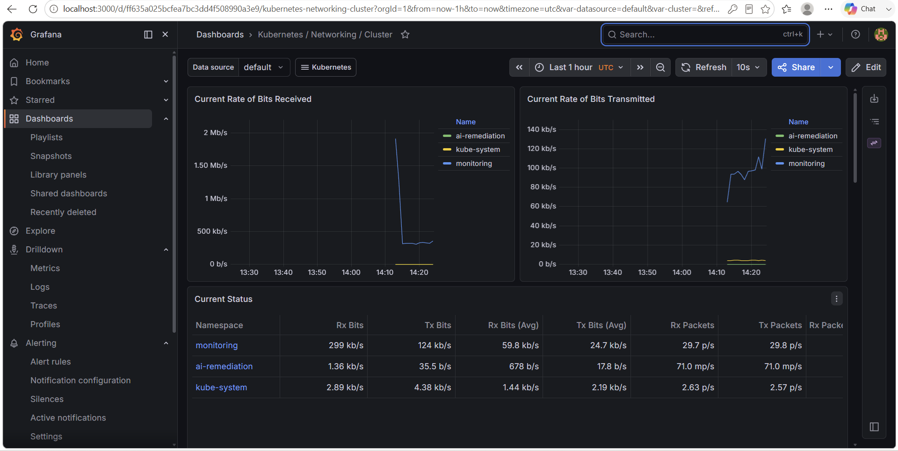

*Network traffic monitoring showing transmitted and received traffic across Kubernetes namespaces and workloads.*

The monitoring stack provides complete visibility into both the AI remediation workflow and the underlying Kubernetes infrastructure, enabling proactive operations and faster troubleshooting.
